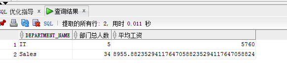
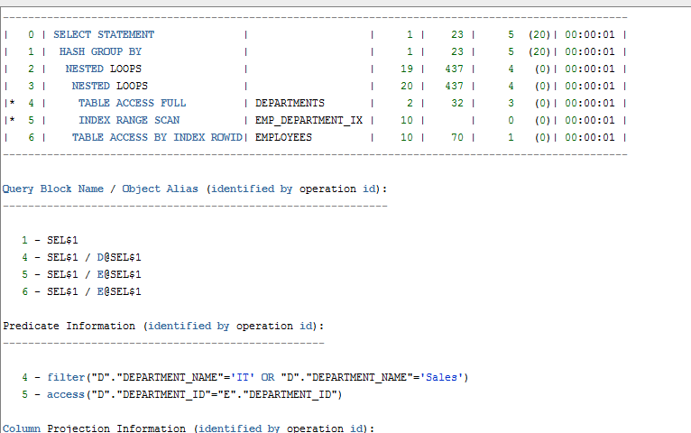
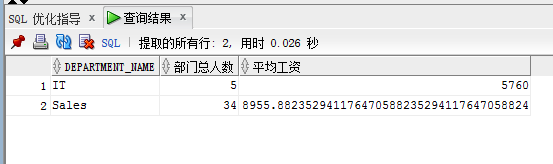
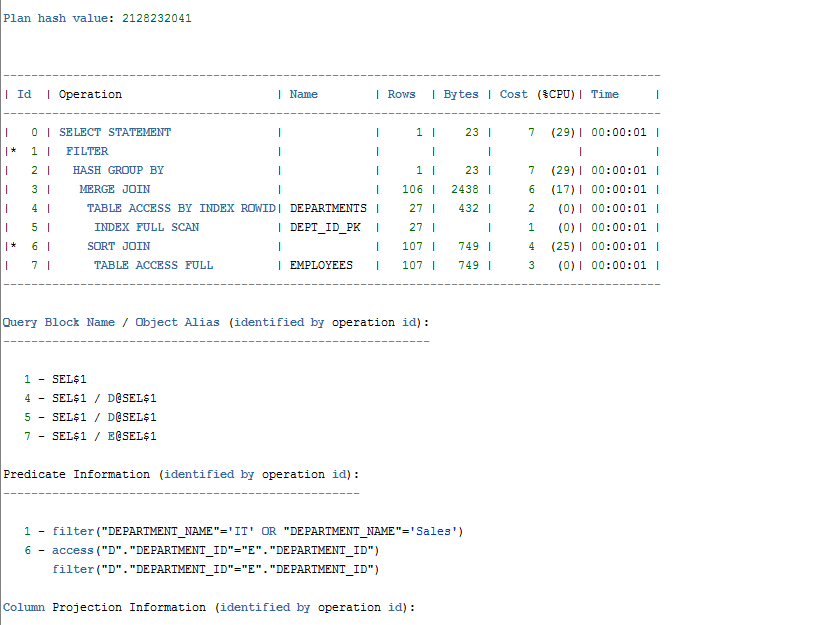
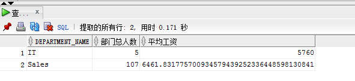

# 查询1
sql:
SELECT d.department_name，count(e.job_id)as "部门总人数"，

avg(e.salary)as "平均工资"

from hr.departments d，hr.employees e

where d.department_id = e.department_id

and d.department_name in ('IT'，'Sales')

GROUP BY department_name;
# 执行结果：

# 执行计划：

# sql优化：

通过创建一个或多个索引可以改进此语句的执行计划；  创建推荐的索引可以显著地改进此语句的执行计划。但是, 使用典型的 SQL 工作量运行 "访问指导"
可能比单个语句更可取。通过这种方法可以获得全面的索引建议案, 包括计算索引维护的开销和附加的空间消耗。
# 查询2
sql:
SELECT d.department_name，count(e.job_id)as "部门总人数"， 

avg(e.salary)as "平均工资"

FROM hr.departments d，hr.employees e

WHERE d.department_id = e.department_id

GROUP BY department_name

HAVING d.department_name in ('IT'，'Sales');
# 执行结果

# 执行计划

# sql优化 
sql developer没有给出优化语句
# 比较
查询1中SQL语句的cost=5，consistent gets=10，查询2中SQL语句的cost=7,consistent gets=9。执行计划中的代价cost虽然要影响执行时间，但cost不是唯一影响执行时间的因素
注意：WHERE和HAVING的区别：
WHERE 是在执行GROUP BY操作之前的过滤，表示从全部数据之中筛选出部分的数据，在where中不能使用统计函数
HAVING 是在GROUP BY分组之后的再次过滤，可以在HAVING子句中使用统计函数
# 自定义查询
 SELECT d.department_name,count(e.job_id)as "部门总人数",
 
avg(e.salary)as "平均工资"

FROM hr.departments d,hr.employees e

WHERE d.department_id = e.department_id

and d.department_name = 'IT' or d.department_name = 'Sales'

GROUP BY department_name

# 运行结果

